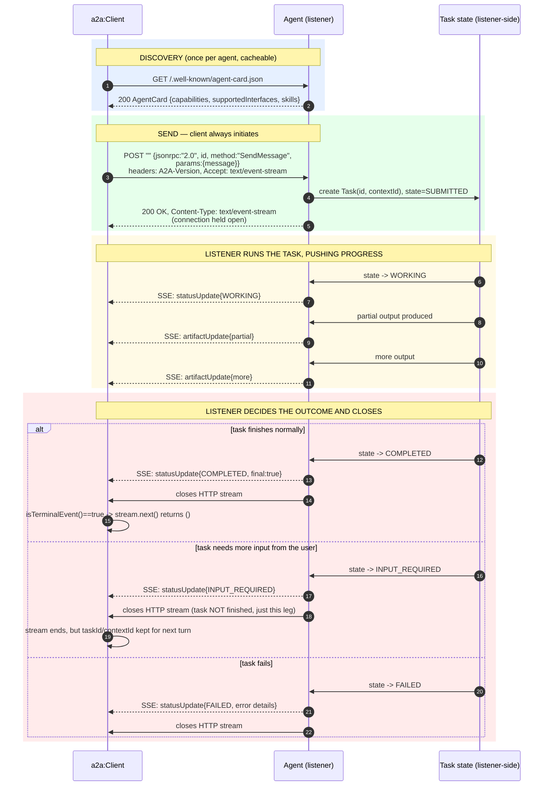
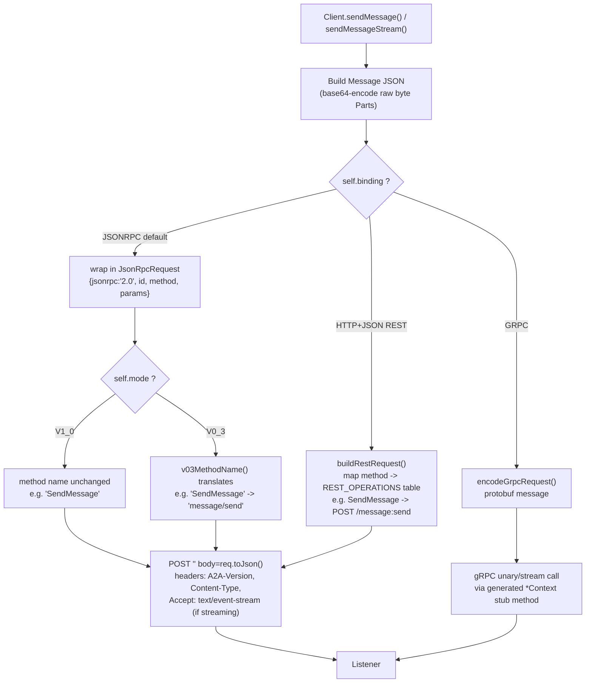
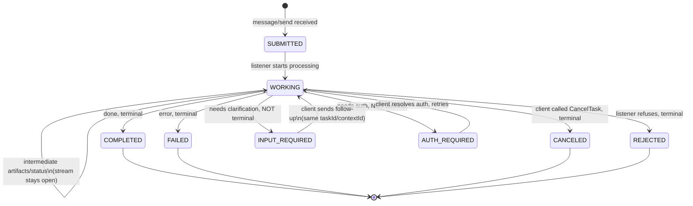
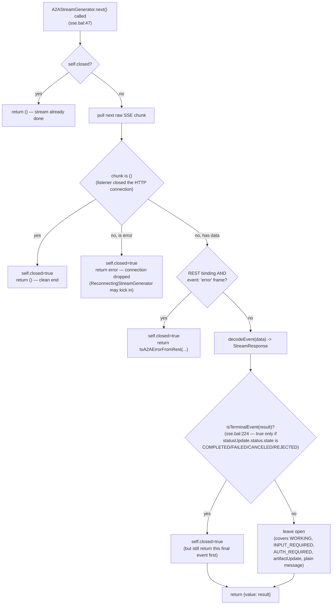
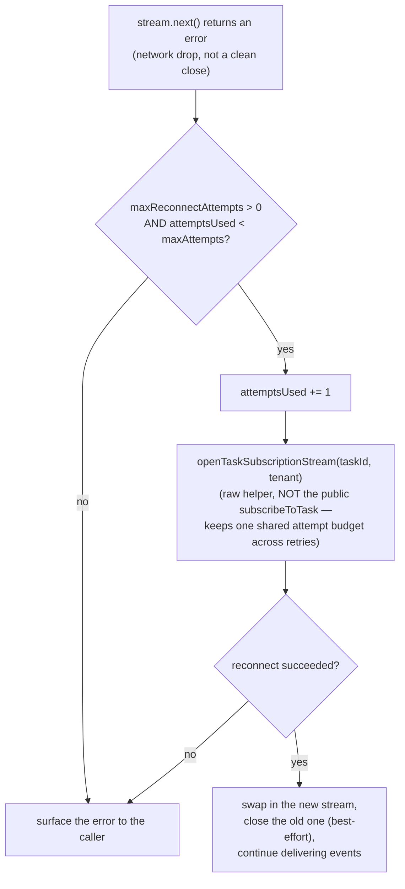

# A2A Client ↔ Listener: Full Interaction Lifecycle

This document explains, end to end, how the `ballerina/a2a` **client**
talks to an A2A **listener** (a remote agent's server side): who opens
the connection, how a message becomes a task, how streaming updates
flow, and — the part that trips people up — **how and when the SSE
stream actually closes**, on both sides.

Two roles, one protocol:

| Role | What it does | Who implements it here |
|---|---|---|
| **Client** | Discovers an agent, sends messages, opens SSE streams, decodes events, maps errors | `ballerina/a2a` (`client.bal`, `sse.bal`, `errors.bal`) — this is what our demo/tests use |
| **Listener** (server) | Publishes an AgentCard, accepts `message/send` requests, runs the task, pushes status/artifact updates, decides when to close the stream | **Not implemented in `ballerina/a2a`** (client-only library, server support is on its roadmap). In this repo, the listener side is always one of four external reference agents: Python `a2a-sdk` (helloworld), Google ADK (adk_currency_agent), LangGraph (langgraph_agent), or Java A2A SDK/Quarkus (dice_agent) |

---

## 1. Full cycle — one complete turn, start to finish

**Who initiates what:** the client always dials first (discovery, then
send). The listener never calls the client — everything after the
initial POST is the listener pushing down the *same* still-open HTTP
response. There is no separate callback connection unless push
notifications (webhooks) are configured (§6).

---

## 2. Message transport — how a request becomes wire bytes

Every outbound request — unary or streaming, any binding — carries the
**mandatory `A2A-Version` header** (`client.bal:493-507`, `buildHeaders`).
An agent seeing this header missing/empty is required by spec to
assume v0.3, silently downgrading the interaction — so the client
never omits it.

Three transport bindings exist (`TransportBinding` type), all
producing the *same* client-visible `Task`/`Message`/`StreamResponse`
result types — the binding only changes wire shape, never the
Ballerina-side API:

| Binding | Wire shape | Where |
|---|---|---|
| `JSONRPC` (default) | JSON-RPC 2.0 envelope, single POST endpoint | `client.bal:558-589` (`rpcCall`) |
| `HTTP+JSON` (REST) | Per-operation REST routes (`POST /message:send`, `GET /tasks/{id}`, ...) | `client.bal:602-630` (`restCall`) |
| `GRPC` | Protobuf over gRPC, generated stub | `client.bal:641-650` (`grpcCall`) |

---

## 3. Task lifecycle state machine (listener-owned)

The client never sets task state directly — it only observes states
the listener reports. `TaskState` (`types.bal:365`):

Only the four states in the bottom-right cluster (`COMPLETED`,
`FAILED`, `CANCELED`, `REJECTED`) are **terminal**. `INPUT_REQUIRED`
and `AUTH_REQUIRED` end the *current SSE stream* but leave the task
itself alive on the listener, addressable later by `taskId` via
`getTask`, `subscribeToTask`, or a follow-up `sendMessage`/
`sendMessageStream` carrying the same `taskId`/`contextId`.

---

## 4. How the client decides to close its side of the stream

This is the exact logic in `sse.bal`, function by function:

Two subtleties worth calling out:

- **`isTerminalEvent` only inspects `statusUpdate` events.** A bare
  `task` snapshot event or an `artifactUpdate` never closes the stream
  by itself, even if (hypothetically) it embedded a terminal-looking
  status — only a dedicated `TaskStatusUpdateEvent` carrying one of
  the four terminal states does (`sse.bal:224-234`).
- **The terminal event is still delivered to the caller** before the
  generator marks itself closed — so `demo/main.bal`'s loop always
  sees the `COMPLETED`/`FAILED` event printed, then gets `()` on the
  *next* call to `events.next()`, not before.

On the **listener** side (not implemented in `ballerina/a2a` today —
see the callout in §7), the equivalent decision is symmetric: the
listener holds the HTTP response open and, on every state transition,
writes an SSE frame; the moment it writes a frame whose state is one
of the four terminal states, it also ends the HTTP response itself
(closes the connection) — the client-side `isTerminalEvent` check
exists specifically to recognize that as a *planned* close, not a
dropped connection. If the listener instead needs to pause and wait
for the client (`INPUT_REQUIRED`/`AUTH_REQUIRED`), it closes the HTTP
response too, but records the task as still-open in its task store, so
a later `subscribeToTask(taskId)` or `getTask(taskId)` still resolves.

---

## 5. Reconnection after an unplanned drop

Per spec §3.1.6, a resubscription's first delivered event is always
the task's *current* state — so a reconnect may re-deliver a status
the client already saw, but never loses one. This is opt-in
(`Client.init(..., maxReconnectAttempts: N)`, default `0` = old
behavior, error surfaces immediately). Implementation:
`ReconnectingStreamGenerator`, `sse.bal:134-218`.

---

## 6. Alternative to holding a stream open: push notifications

For long-running tasks where keeping an SSE connection open isn't
practical (client goes offline, mobile app backgrounded, etc.), the
protocol supports webhook-style push instead of streaming:
`TaskPushNotificationConfig` (`types.bal:493`) lets the client register
a callback URL; the listener POSTs task updates to that URL instead of
over a held-open SSE response. The client then polls `getTask(taskId)`
or waits for the webhook hit rather than iterating an SSE stream. Not
exercised by our demo, but available via
`Client.setTaskPushNotificationConfig`/`getTaskPushNotificationConfig`.

---

## 7. What the "listener" side does — and the honesty callout

**`ballerina/a2a` cannot play the listener role.** Its own README
states server/listener support is deliberately out of scope for the
current phase (roadmap item: `a2a:Listener` + service-object contract,
not started). There is no `Service` type, no `Listener` class, no
`service.bal` in the package — confirmed by inspection, not inferred.
An old superseded design draft
(`a2a-ballerina/a2a/docs/archive/A2A_Technical_Design_superseded_listener_draft.md`)
sketches what one *might* look like (`listener a2a:Listener` +
`service /a2a on a2aEp { remote function onTask(...) {...} }`, a
`TaskStore`, an SSE push loop that `break`s on a terminal
`TaskStatusUpdateEvent`) — but it's explicitly marked "do not
implement from this section," kept for historical reference only.

So every listener our client talks to in this repo is a **separate,
independently-built A2A server**, in a different language/SDK, that
already implements this side of the spec on its own:

| Demo server | Listener implementation |
|---|---|
| `helloworld` | Python, official `a2a-sdk` reference server |
| `adk_currency_agent` | Python, Google ADK |
| `langgraph_agent` | Python, LangGraph |
| `dice_agent` | Java/Quarkus, A2A Java SDK 1.1.0 + LangChain4j |

None of the four live in this repo as source — each `servers/<name>/`
here holds only `findings.md`/`setup.md` pointing at a separate
`a2a-samples` checkout the demo is run against.

---

## 8. What our demo actually exercises

`demo/main.bal` is a **plain console program playing only the client
role** — never a listener, never an orchestrator with an upstream
caller of its own. It is the left-hand side of §1's diagram, run by a
human typing at a prompt instead of by another agent:

1. `resolveAgentCard` — discovery (§1 step 1-2)
2. `sendMessage` — one unary send/response, no streaming
3. `sendMessageStream` — the full open→push→close cycle from §1 and §4
4. An interactive loop that continues a task via `taskId`/`contextId`
   whenever a turn ends in `INPUT_REQUIRED` (the "non-terminal close"
   branch of §4), otherwise starts fresh

This demonstrates the entire *client-side* contract this document
describes, against four real, independently-built listeners — but the
"agent-wraps-a2a:Client-to-call-another-agent-that-is-itself-a-listener"
shape from a full multi-agent deployment isn't buildable end-to-end in
Ballerina today, only the client half of it.

---

## 9. Code reference index

| Concern | File | Lines |
|---|---|---|
| Discovery | `client.bal` | `fetchAgentCardWithCaching` 87-116, `resolveAgentCard` 127 |
| Client construction / mode detection | `client.bal` | `init` 427-483 |
| Mandatory headers | `client.bal` | `buildHeaders` 493-507 |
| JSON-RPC unary dispatch | `client.bal` | `rpcCall` 558-589 |
| REST unary dispatch | `client.bal` | `restCall` 602-630 |
| gRPC unary dispatch | `client.bal` | `grpcCall` 641-650 |
| `sendMessage` | `client.bal` | 815-869 |
| Opening a stream | `client.bal` | `openEventStream` 877-923 |
| SSE decoding + terminal-close logic | `sse.bal` | `A2AStreamGenerator` 35-123, `isTerminalEvent` 224-234 |
| Auto-reconnect | `sse.bal` | `ReconnectingStreamGenerator` 134-218 |
| Error taxonomy | `errors.bal` | `A2AError` 20, `toA2AError` 77, `toA2AErrorFromRest` 126, `toA2AErrorFromGrpc` 269 |
| Protocol record types | `types.bal` | `Message` 219, `AgentCard` 313, `TaskState` 365, `Task` 407, `StreamResponse` 457 |
| v0.3 wire translation | `compat_v03.bal` | whole file, 693 lines |
| Demo entry point | `demo/main.bal` | `main` 33, `streamOneMessage` 134-178 |
