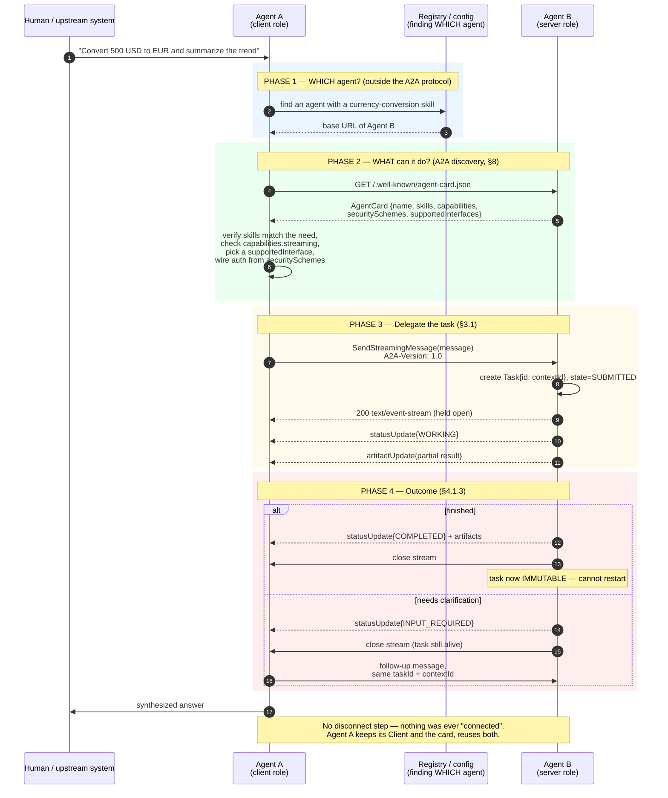
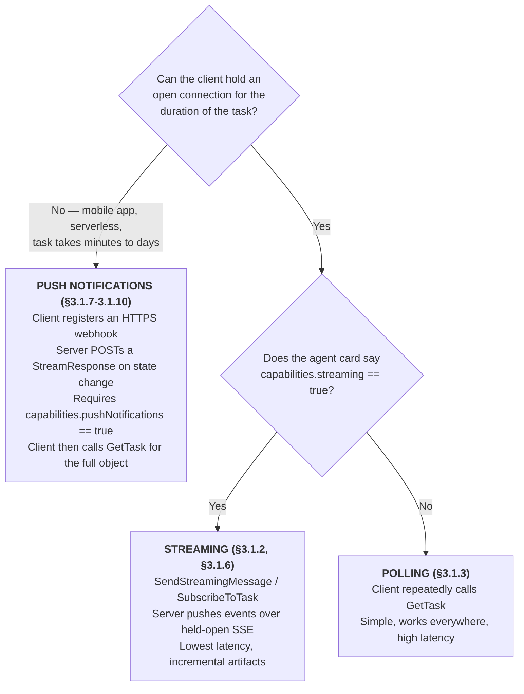
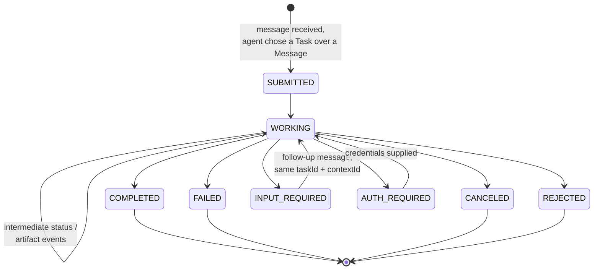
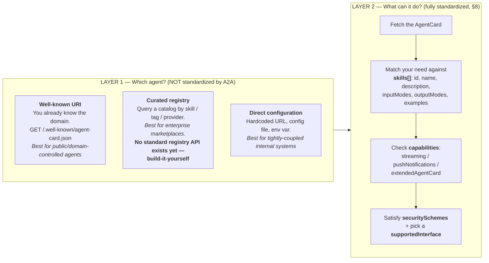
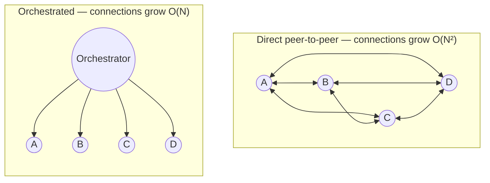
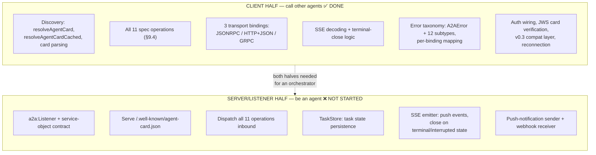

# A2A: Full Protocol Scope, and Where the Ballerina SDK Fits

This document has two halves:

- **Part I — the protocol itself**: what A2A is actually for, the complete
  real-world lifecycle, how an agent finds *which* agent to talk to, and
  when you do (and don't) need an orchestrator.
- **Part II — our side of it**: what building "A2A support for Ballerina"
  actually entails, what's built, what isn't, and what a complete SDK
  requires.

Everything here is checked against the official specification at
[a2a-protocol.org](https://a2a-protocol.org/latest/specification/) and the
official topic guides, with spec section numbers cited inline. Sources are
listed at the end.

---

## 0. Your mental model — validated, with four corrections

Your description was substantially correct. Restated precisely:

> An agent that needs work done (**A2A Client**) discovers an agent that can
> do it (**A2A Server / remote agent**), fetches its Agent Card, determines
> transport and protocol version, constructs a client, and sends the work as
> a **Task**. While working, the server reports progress by one of three
> mechanisms — **streaming (SSE)**, **polling (GetTask)**, or **push
> notifications (webhooks)**. When finished it returns a final state plus any
> **Artifacts**. If a platform of agents exists, an **orchestrator** can
> receive the task, act as a client to specialist agents, and pass results
> back up the chain.

That is right. Four corrections worth internalizing, because each one changes
how you'd design something:

**Correction 1 — "then the agents disconnect" isn't quite the model.**
There is no session, no connection handshake, and nothing to disconnect from.
A2A is stateless HTTP underneath (spec §2.1 — "leverages existing standards
like HTTP, JSON-RPC, and Server-Sent Events"). Every operation is an
independent HTTP request. What persists is not a connection but a **`taskId`
+ `contextId`** on the server side. Our `a2a:Client` object is just held
configuration plus a pooled `http:Client` — constructing one performs zero
network I/O, and there is no "close" or "disconnect" call anywhere in the
library because there is nothing to tear down. The only thing that is ever
genuinely *open* is an individual SSE response body, and only for the
duration of one streaming call.

**Correction 2 — a terminal task is immutable and can never restart.**
Per the official task-lifecycle guide: once a task reaches a terminal state,
"it cannot restart. Any subsequent interaction related to that task, such as
a refinement, must initiate a **new task within the same `contextId`**."
So "the task is done, then the next request repeats the process" is right,
but the continuity mechanism is `contextId` (a shared conversational
session that can span *many* tasks), not task reuse.

**Correction 3 — `INPUT_REQUIRED` also closes the stream.**
Per the official streaming guide, the server closes the stream when a task
reaches "a terminal **or interrupted** state (e.g. `COMPLETED`, `FAILED`,
`CANCELED`, `REJECTED`, or `INPUT_REQUIRED`)." The distinction that matters
is not *stream closed vs. open* but *task finished vs. task still alive*:
`INPUT_REQUIRED`/`AUTH_REQUIRED` close the current stream while leaving the
task resumable. This is exactly the behaviour `sse.bal`'s `isTerminalEvent`
encodes — see [`A2A_CLIENT_LISTENER_LIFECYCLE.md`](./A2A_CLIENT_LISTENER_LIFECYCLE.md) §4.

**Correction 4 — the Agent Card is not fetched per task.**
It's discovery metadata, cacheable (spec §8.6 defines caching policy; this is
why `resolveAgentCardCached` with ETag/`304` support exists). A long-running
orchestrator fetches a downstream agent's card once and reuses it across
thousands of tasks.

---

## Part I — The Protocol

## 1. What A2A is for, and what it deliberately is not

A2A exists to kill point-to-point integration. Without it, connecting N
agents built by different teams in different frameworks requires "custom,
point-to-point solutions, creating significant engineering overhead."

Four design principles (spec §2.1) drive every decision in the protocol —
and each one explains a piece of the wire format:

| Principle | What it forces into the protocol |
|---|---|
| **Simplicity** | Reuses HTTP, JSON-RPC 2.0, SSE. No novel transport. |
| **Enterprise readiness** | First-class auth, `securitySchemes`, signed cards, tracing. |
| **Async support** | Tasks, three update mechanisms, long-running work as a native case. |
| **Opaque execution** | Agents collaborate "without exposing their internal logic, memory, or proprietary tools." |

**Opaque execution is the single most important one to understand**, because
it explains why the Agent Card exists at all. You never see *how* the remote
agent works — no access to its model, prompts, tools, memory, or reasoning.
All you ever get is: a declared identity, declared skills, declared
capabilities, and exchanged messages/artifacts. The Agent Card is the
*entire* public surface of an opaque agent. That is precisely why the card
carries far more than the two fields our `Client.init` happens to consume.

**A2A vs MCP** — worth stating because they're constantly confused. MCP
connects an agent to *tools and data*: stateless, predefined functions. A2A
connects agents to *other agents* as autonomous peers capable of multi-turn
reasoning and negotiation. The spec is blunt that collapsing an agent into a
tool "is fundamentally limiting, as it fails to capture the agent's full
capabilities." They compose: your agent might use MCP for its own tools and
A2A to delegate to peer agents.

## 2. The three roles (spec §2.2)

| Role | Definition |
|---|---|
| **A2A Client** | "An application or agent that initiates requests to an A2A Server on behalf of a user or another system." |
| **A2A Server (Remote Agent)** | "An agent or agentic system that exposes an A2A-compliant endpoint, processing tasks and providing responses." |
| **User** | The entity on whose behalf the client acts. Implicit — not a formal protocol role. |

**These are per-interaction roles, not per-agent identities.** One agent
process is routinely both: a server to its callers, a client to its
downstream specialists. That dual nature is what makes orchestration chains
possible, and it is exactly what a *complete* SDK must support (Part II).

Message sender identity travels in the `Role` enum (spec §4.1.5):
`ROLE_USER` (client→server) and `ROLE_AGENT` (server→client).

## 3. The complete real-world cycle



### The three update mechanisms (spec §3.5)

The choice is driven by how long the work takes and whether the client can
hold a connection:



Three things about push notifications that surprise people:

- The webhook payload is **the same `StreamResponse` shape** as a streaming
  event — not a bespoke format.
- Webhooks are **always HTTP POST**, regardless of the agent's primary
  binding (§3.5.3). A gRPC agent still POSTs to your webhook.
- Security is bidirectional and non-trivial: servers "SHOULD NOT blindly
  trust and send POST requests to any URL provided by a client" (SSRF
  defence), and the receiving webhook "MUST rigorously verify the
  authenticity of incoming notification requests" — typically JWT signed by
  the server, validated against its JWKS endpoint, with replay protection
  via timestamps.

### Task state machine (spec §4.1.3)



Note the asymmetry that trips everyone up: an agent may answer a message
with either a stateless **`Message`** (a direct reply, no tracking) or a
stateful **`Task`**. It chooses a Task when it must map the request "to a
supported capability that requires substantial, trackable work over an
extended period." This is why `sendMessage` returns `Task|Message` — the
server decides, not the caller.

`contextId` is the layer above tasks: it "enables collaboration towards a
common goal or a shared contextual session across multiple, potentially
concurrent tasks." Terminal tasks are immutable; refinements open new tasks
under the same `contextId`.

## 4. How do you know you're talking to the *right* agent?

This is the question you asked, and it has a two-layer answer, because
**A2A deliberately splits "which agent exists" from "what can this agent
do."**



**The blunt truth about Layer 1**: A2A does not solve it. There is no
protocol-level "list all agents" endpoint and — per the official discovery
guide — "the current A2A specification does not prescribe a standard API for
curated registries." Every deployment picks its own mechanism. In this repo
today, Layer 1 is `serverUrl()` in `demo/main.bal` returning a hardcoded
string — which is a perfectly legitimate implementation of *direct
configuration*, the third strategy.

**Layer 2 is where the Agent Card earns its keep**, and it directly answers
your question about skills and capabilities.

### Why skills/capabilities exist when `Client.init` ignores them

Recall the finding from our code walkthrough: `Client.init` reads the card
for exactly two things — protocol mode via `detectProtocolModeForBinding`,
and optionally auth via `buildAuthFromCard`. It stores no card field. It is
therefore entirely true that **if you already know the transport and protocol
version, you can construct a working client with no card at all.**

That does not make the rest of the card decorative. It means the rest of the
card is consumed by **your agent's own logic, not by the transport layer** —
and mostly *before* a client is ever constructed:

| Field | Who consumes it | When | What breaks without it |
|---|---|---|---|
| `skills[]` | Your agent's routing/selection logic | **Before** constructing a client | You cannot tell whether this agent can do the job. You'd send currency questions to a dice-roller and get a garbage answer with no error. |
| `capabilities.streaming` | Your agent, choosing an update mechanism | **Before** the first call | You call `sendStreamingMessage` against an agent that doesn't support it and take a runtime `UnsupportedOperationError` instead of choosing polling up front. |
| `capabilities.pushNotifications` | Same | Before registering a webhook | Runtime `PushNotificationNotSupportedError`. |
| `capabilities.extendedAgentCard` | Same | Before calling `getExtendedAgentCard` | Runtime `UnsupportedOperationError`. |
| `securitySchemes` | `buildAuthFromCard`, or you manually | **During** construction | Every call returns 401/403. |
| `supportedInterfaces[]` | You, picking `binding`; `detectProtocolModeForBinding` | During construction | Wrong transport, or a silent v0.3/v1.0 dialect mismatch. |
| `name`, `description`, `provider` | Humans, logs, audit trails | Anytime | Nothing breaks; you just can't explain to anyone which agent answered. |
| `signatures` | `verifyAgentCardSignature` | Before trusting anything | You can't prove the card wasn't tampered with in transit. |

**So: "how do we know we built the bridge with the correct agent?"** You know
because *you checked the skills before building the bridge*. Nothing in the
library does it for you, and nothing in the protocol does it for you —
matching a task to a skill is application logic, by design (opaque execution
means the protocol can't reason about what an agent does; it can only carry
the agent's own declaration). A real orchestrator does something like:

```ballerina
a2a:AgentCard card = check a2a:resolveAgentCard(candidateUrl);

// LAYER 2 gate — application logic, not library logic
boolean canDoIt = card.skills.some(s => s.id == "currency_conversion");
if !canDoIt {
    // try the next candidate; do not build a client for this one
}
if !card.capabilities.streaming {
    // fall back to sendMessage + GetTask polling
}

a2a:Client c = check new (candidateUrl, agentCard = card);
```

The card is the contract. `Client` only reads the two fields it needs to
speak the right dialect; **you** are responsible for reading the fields that
determine whether talking to this agent is sensible at all.

## 5. Do you need an orchestrator? (your 5-server-agents question)

**No — the protocol does not require one.** Your Ballerina client agent can
hold five `a2a:Client` instances, one per downstream agent, inspect each
one's skills, and dispatch directly. Nothing in A2A mandates a hub. This is
the **peer-to-peer / direct** pattern: "a task may originate with one agent,
which identifies another agent capable of contributing and initiates a direct
exchange."

But there is a real engineering reason orchestrators dominate at scale:



| | Direct peer-to-peer | Orchestrated |
|---|---|---|
| Connections | O(N²) — every pair needs identity, permissions, loop protection | O(N) — a star, linear growth |
| Skill routing | Every agent needs its own discovery + selection logic | Centralized in one place |
| Loop detection | Hard — no single vantage point | One place to detect cycles |
| Context isolation | Manual | Natural |
| Latency | Lower — one hop | Higher — two hops minimum |
| Best for | Two tightly-coupled collaborators where latency matters | Most real workflows |

**Practical recommendation**: default to an orchestrator; reach for direct
peer-to-peer when two agents collaborate tightly and the extra hop's latency
matters. With five downstream agents, either works — but the orchestrator
becomes clearly correct the moment those five need to call *each other*
too.

Critically, note that **an orchestrator is not a special protocol entity**.
It is simply an agent that is a server to its caller and a client to its
workers — which is exactly why an SDK that only implements the client half
cannot build one.

---

## Part II — Building A2A Support for Ballerina

## 6. What "an A2A SDK" actually means

The protocol landscape today has five official SDKs (Python — the reference
implementation, JavaScript/TypeScript, Java, Go, and C#/.NET). **Ballerina is
not among them**; that gap is what this project exists to close.

A complete SDK has two halves, and they are close to disjoint bodies of work:



## 7. What we've built (the client half)

`ballerina/a2a` — client-side complete and verified:

- **All 11 spec operations** (§9.4): `sendMessage`, `sendStreamingMessage`,
  `getTask`, `cancelTask`, `subscribeToTask`, `listTasks`, the four
  push-notification-config operations, and `getExtendedAgentCard`.
- **All three transport bindings**, selectable per-`Client` via `binding`.
- **Both wire dialects** — current v1.0 and legacy v0.3 — auto-detected from
  the card and translated transparently (`compat_v03.bal`), so calling code
  never branches.
- **Hardening**: `A2A-Extensions` negotiation, AgentCard JWS verification,
  ETag-aware card caching, opt-in automatic SSE reconnection, automatic
  client-auth wiring from the card.
- **354 tests** in-package, plus real-server interop proof in this repo
  against four independently-built agents (three Python, one Java) — the
  point being that testing only against your own mocks validates your own
  misreadings of the spec.

Known remaining client-side gaps: mutual-TLS auto-wiring (a client cert
isn't a single credential string), and RFC 8785 JSON canonicalization for
JWS verification (so signatures from external signers aren't yet verifiable).

## 8. What's missing (the server half) — and what it takes

Deliberately deferred, not started. To make a Ballerina program *be* an
agent, these are the pieces:

**8.1 `a2a:Listener` + a service-object contract.** The developer-facing
shape — something like a `service` object with remote functions the listener
dispatches into. This is the single biggest design decision, because it
determines the whole ergonomics of the SDK. The archived draft sketched
`service /a2a on a2aEp { remote function onTask(...) }`, but it's explicitly
marked "do not implement from this section" and left several questions
unresolved (multi-turn `INPUT_REQUIRED` signalling, streaming intermediate
results, push-notification integration).

**8.2 Serve the Agent Card.** Respond to `GET /.well-known/agent-card.json`
with a card built from the developer's declarations — plus authoring
ergonomics for `skills`/`capabilities`, ETag support for §8.6 caching, and
ideally JWS signing (§8.4).

**8.3 Inbound dispatch for all 11 operations**, across whichever bindings you
support. Note the reversal of effort: the client only ever *sends* what it
chooses to send, but a server must *correctly handle everything a
conformant client may send* — including `historyLength` on `GetTask`,
pagination on `listTasks`, and per-binding error shapes (JSON-RPC codes vs.
`google.rpc.ErrorInfo` reasons vs. gRPC status codes).

**8.4 A `TaskStore`.** The client is stateless; a server fundamentally is
not. It must persist task id, contextId, status history, and artifacts, and
serve them back on `GetTask`/`listTasks` after the originating connection is
long gone. An in-memory default plus a pluggable interface is the standard
shape.

**8.5 A server-side SSE emitter.** The mirror of `sse.bal`: hold the response
open, write `TaskStatusUpdateEvent`/`TaskArtifactUpdateEvent` frames as work
progresses, and close on terminal *or* interrupted state. Ballerina needs an
idiomatic equivalent of the emitter pattern here.

**8.6 Push-notification sender and webhook receiver.** Sending requires
SSRF-safe URL validation and signing outbound JWTs; receiving requires
signature verification against JWKS plus replay protection.

**8.7 Conformance.** The official [a2a-tck](https://github.com/a2aproject/a2a-tck)
validates implementations across all three transports. We already have
experience running it — `servers/dice_agent/findings.md` documents using it
against that agent, where an unpatched build scored 6/114 MUST-level checks
because the SDK version didn't emit `supportedInterfaces`. That's the bar a
Ballerina listener would need to clear.

**The payoff**: only with both halves can a Ballerina program be the
orchestrator from §5 — a server to its caller and a client to its workers.
Today Ballerina agents can *consume* the agent ecosystem; with the listener
half they could *join* it.

---

## 9. Summary — the honest scope

| Question | Answer |
|---|---|
| Is my mental model right? | Yes, with four corrections (§0): no connections to disconnect, terminal tasks are immutable, `INPUT_REQUIRED` also closes the stream, cards are cached not re-fetched. |
| Does the card only supply transport + version? | For **`Client` construction**, effectively yes. For **deciding whether to talk to this agent at all**, no — that's `skills`/`capabilities`, consumed by your logic before construction. |
| How do I know it's the right agent? | You check `skills[]` yourself, before building a client. Neither the protocol nor the library does this for you — opaque execution means only the agent's own declaration is available. |
| Do I need an orchestrator for 5 agents? | No. Direct dispatch works. But O(N²) connectivity, distributed loop detection, and duplicated routing logic make an orchestrator the better default. |
| Can Ballerina agents be servers today? | **No.** Client half complete; listener half not started. §8 is the roadmap. |

---

## Sources

- [Agent2Agent (A2A) Protocol Specification](https://a2a-protocol.org/latest/specification/)
- [What is A2A? — core concepts and design principles](https://a2a-protocol.org/latest/topics/what-is-a2a/)
- [Agent Discovery](https://a2a-protocol.org/latest/topics/agent-discovery/)
- [Life of a Task](https://a2a-protocol.org/latest/topics/life-of-a-task/)
- [Streaming and Asynchronous Operations](https://a2a-protocol.org/latest/topics/streaming-and-async/)
- [a2aproject/A2A — agent-discovery.md](https://github.com/a2aproject/A2A/blob/main/docs/topics/agent-discovery.md)
- [a2aproject/a2a-tck — conformance test suite](https://github.com/a2aproject/a2a-tck)
- [SDK & Implementation Guide (DeepWiki)](https://deepwiki.com/a2aproject/A2A/3-sdk-documentation)
- [A2A Protocol: The Definitive Agent-to-Agent Guide (Tyk)](https://tyk.io/learning-center/a2a-protocol-architecture-and-technical-specification/)
- [Multi-Agent Coordination Patterns (Atlan)](https://atlan.com/know/multi-agent-coordination-patterns/)
- In-repo: [`docs/A2A_CLIENT_LISTENER_LIFECYCLE.md`](./A2A_CLIENT_LISTENER_LIFECYCLE.md),
  `a2a-ballerina/a2a/README.md` (status + roadmap),
  `a2a-ballerina/a2a/docs/A2A_Technical_Design.md` §12.2 (deferred Phase 2),
  `servers/dice_agent/findings.md` (TCK experience).
